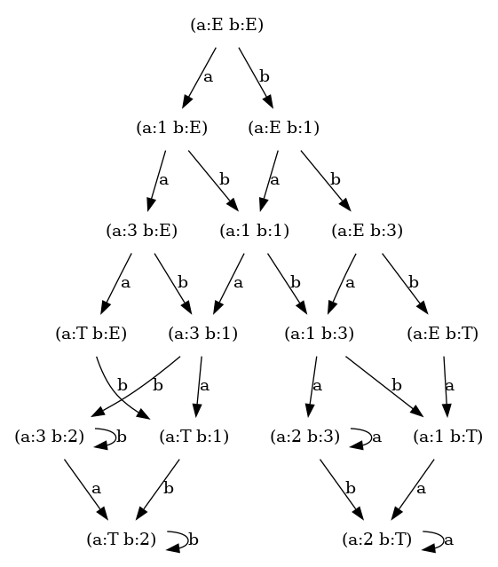
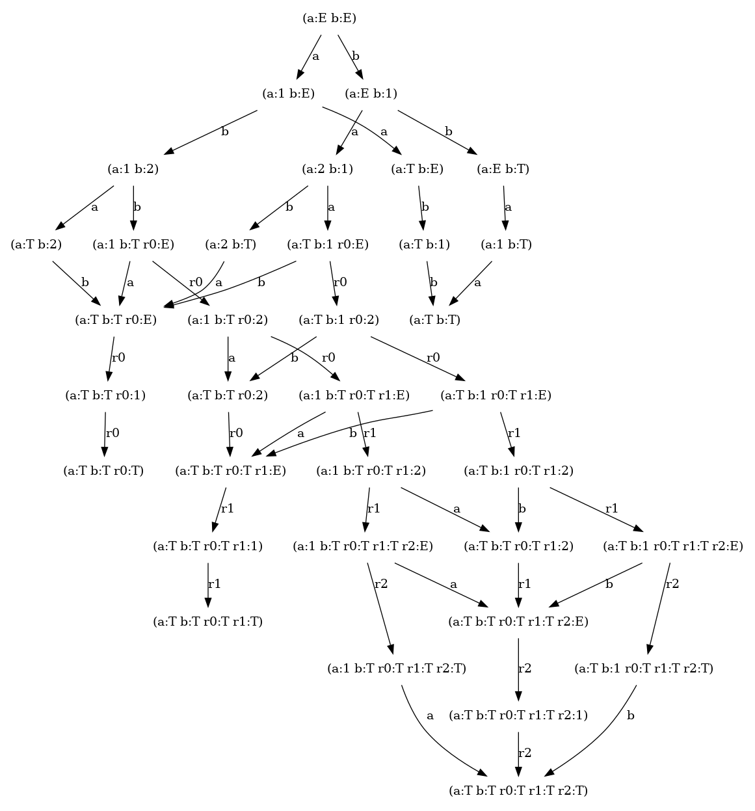
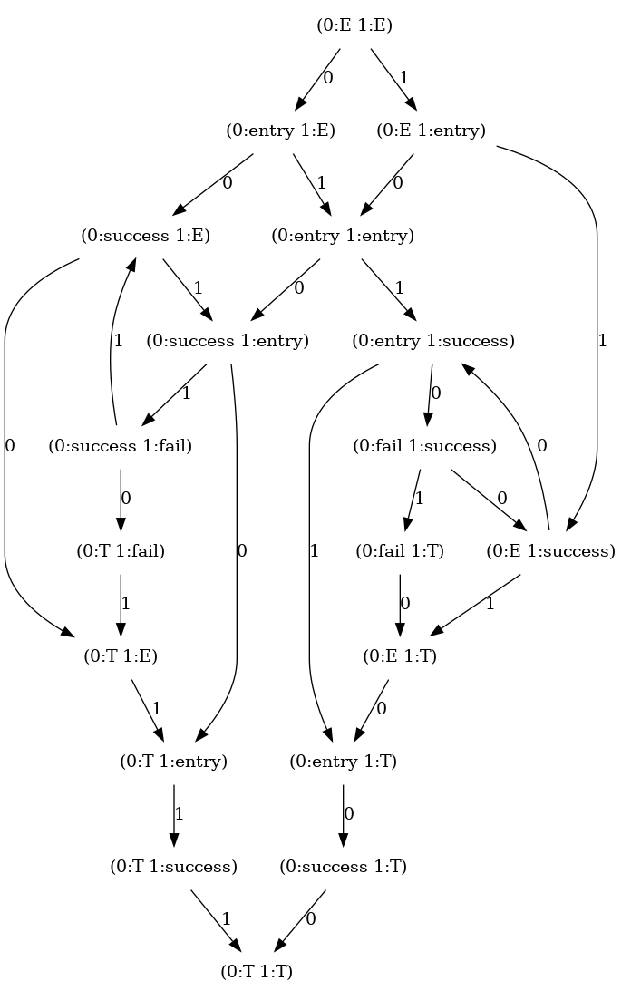
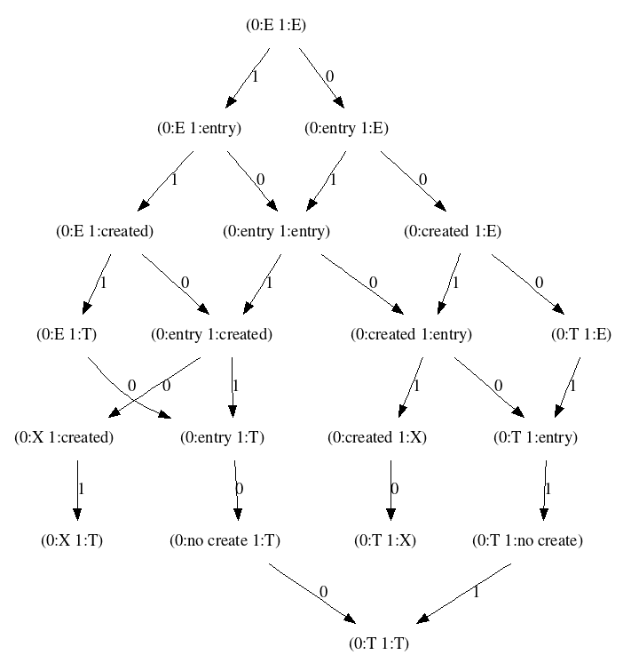

# race

Race condition modelling package.

## What does it do?

### Deadlock example

[Here's](./race2_examples/deadlock.py) an example code that you can run yourself.

Imagine two threads defined by the function below trying to compete for a resource:
```python3
def thread(database: DB, thread_id: int) -> ProcessGenerator:
    yield 1

    while not database.compare_and_swap(
        value_key="1", expected_value=None, set_value=thread_id
    ):
        yield 2

    yield 3
```

Please note the `yield` points. Why are we using generators? This makes it every easy to define
the [yield points](https://en.wikipedia.org/wiki/Yield_(multithreading)) of processes. It means that
at these points we allow to give up the current control of the CPU and allow the other
process to execute.

The function of this library is to take the threads with their yield points, and then execute
them in every possible combination of "context switches" at these yield points.

If you run the given example and then use graphvis to visualise what the library is able to produce you'll
get the image below:


The numbers in this diagram directly relate to the numbers passed into `yield` within the function
as as you should note they only have values of `1`, `2`, `3`, `T` and `E`. The letters in diagram represent 
processes, and as the example only instantiates 2 processes there's 2 letters: `a` and `b`.

Every vertex in the graph represents the current complete state of all the processes. As you will notice 
the only vertex that has no incoming edges is represented by `(a:E b:E)` meaning that neither process `a` or `b` had yet
yielded any state IDs, and thus they are not started yet (the processes exist, but have never been yielded).

The edges represent the next process that we decide to execute. Starting from `()`, we can either pick `a` or `b`
And it will yield a new global state of the system. Executing `a` means that `a` does `yield 1` and thus
is now in state `1`, thus entering vertex labeled as `(a: 1)`.

Paying attention to the bottom of the diagram, we see a total of 2 potential ending states: either `(a:T b:2)`
or `(a:2 b:T)`. This means that either `a` or `b` will finish, but never both of them. It means that the deadlock is
possible.

### Retry example

[Here's](./race2_examples/retry.py) another example code that you can run yourself. Here we are modelling a system where a process tries to 
acquire a lock and then release it. If a process fails to acquire (due to another process having acquired a lock before) 
a lock it retries with a maximum of 3 attempts. The diagram below demonstrates that under the condition of no new processes starting
3 retries (retry processes are marked with `rX` where `X` is the number of retry) would never be reached, although 2 retries will be.



### Self Retry example

[Here's](./race2_examples/self_retry.py) another example code that you can run yourself. Here we are modelling a system where
we are attempting to acquire a lock, and if we fail, we restart the task. The practical challenge here is that there could
be a runaway number of processes if we do not handle it gracefully. The most interesting bit here is to note that every
time a process transitions into `fail` state it can also go back to `E` (entry) state as if it was an old process.




### Django table locking example

[Here's](./race2_examples/django/lock.py) 

We're simulating a table locking mechanism using a table defined using Django ORM, please note here we're using `ThreadExecutor`
part of the engine where we can turn any executable function into a generator via explicit calls to `yield_fun_yield` 
(ugly name for now).
```
def lock(user_id: int):
    with transaction.atomic():
        yield_fun_yield("entry")
        task_lock_obj, created = Lock.objects.get_or_create(user_id=user_id)
        if created:
            yield_fun_yield("created")
        else:
            yield_fun_yield("no create")
```
It exhibits a pretty interesting behaviour where if first thread reaches "created", the other thread can not proceed
anymore because it needs to wait till other finishes (yielding a deadlock exception). This is supported by the `ThreadExecutor`
via timeout mechanism.



## Known idiosyncracies

Busy loops should only have 1 label per 1 execution of a loop.
The same thing goes for all other loops.

Otherwise we will have to interleave the loop cycle with all possible executions of the other thread.

Which is essentially a runtime multiplier.

For a process executing in a loop:

```
a, b, c, d, a, b, c, d, a, b, c, d, a, b, c, d, a
```

Even if another process is a one-label process, we
can interleave them this way:
```
a, X, b, c, d, a, b, X, c, d, a, b, c, X, d, a, b, c, d, X, a
```

